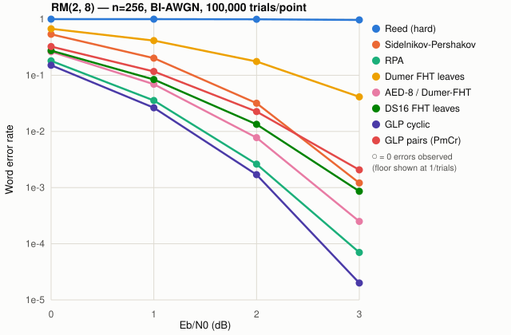
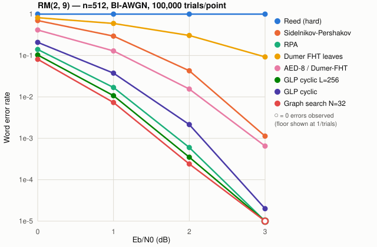
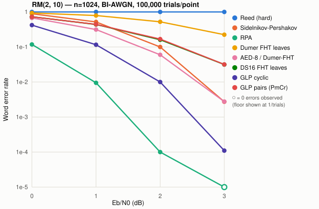

# Large-scale comparison: RM(2,8), RM(2,9), RM(2,10)

Word error rate (WER) over a BI-AWGN channel, 100,000 trials per
point, for every decoder in the package plus the generic wrappers.
Generated by [`compare_large.jl`](compare_large.jl) (RM(2,8), RM(2,9),
and the start of RM(2,10)), its continuation
[`compare_large_resume_m10.jl`](compare_large_resume_m10.jl) (the rest
of RM(2,10)), and [`compare_large_gs.jl`](compare_large_gs.jl) (the
`GraphSearchDecoder` row, run separately since that decoder was added
to the package after the rest of this comparison had already
completed) — see [Reproducing this run](#reproducing-this-run)
below for why it's split across scripts and how to redo it in one
piece.

## Setup

- Codes: RM(2,8) [n=256, k=37, d=64], RM(2,9) [n=512, k=46, d=128],
  RM(2,10) [n=1024, k=56, d=256].
- Channel: BI-AWGN, Eb/N0 ∈ {0, 1, 2, 3} dB. This range is narrower
  than the package's default sweep (`benchmarks/compare.jl` uses
  0–5 dB): at these code lengths the near-ML decoders already reach
  zero observed errors out of 100,000 trials by 3 dB, so higher points
  would add no information here while costing real time on the
  slowest decoders (RPA, Sidel'nikov-Pershakov, BP are all O(n²)-ish).
- Threaded Monte-Carlo harness (`psimulate` in the scripts): trials
  statically partitioned across 8 threads, each with its own
  thread-local RNG.
- Decoders: `ReedDecoder`, `ChaseDecoder(ReedDecoder(); t=4)`,
  `BPDecoder`, `SidelnikovPershakovDecoder` (weighted and
  `:majority`/Sakkour), `RPADecoder`, `DumerDecoder` (min-sum and
  `leaves=:fht`), `GMDDecoder(DumerDecoder(leaves=:fht))`,
  `AutomorphismEnsembleDecoder(DumerDecoder(leaves=:fht); size=8)`,
  `DumerShabunovDecoder(16, leaves=:fht)`, `GLPDecoder` (`:cyclic` and
  `:pairs`/PmCr ensembles), `GraphSearchDecoder(iters=32)`. See
  [ALGORITHMS.md](../ALGORITHMS.md) for what each of these does.
### Decoder label glossary

Table labels for the generic wrappers (`ChaseDecoder`, `GMDDecoder`,
`AutomorphismEnsembleDecoder`) name the wrapper, its parameter where
it has one, and the constituent decoder it wraps, separated by a
slash — wrapper before, decoder it's built on after. Every label used
in the tables below:

| Label | What it is |
|---|---|
| `Reed (hard)` | `ReedDecoder()` — Reed's 1954 majority-logic decoder. "(hard)" flags that it's *hard-decision*: LLRs are thresholded to bits before decoding, discarding reliability information ([details](../ALGORITHMS.md#reeds-majority-logic-decoder)). |
| `Chase-II(t=4)/Reed` | `ChaseDecoder(code, ReedDecoder(); t=4)` — tries all 2⁴=16 sign-flip patterns of the `t=4` least-reliable positions through `ReedDecoder`, keeping the best-correlating result; turns a hard decoder into a soft-input one ([details](../ALGORITHMS.md#chase-ii-decoding)). |
| `BP` | `BPDecoder(code)` — Belief Propagation (sum-product) on the dual code's redundant parity-check set. Included as a weak-decoder baseline, not a method to reach for ([details](../ALGORITHMS.md#belief-propagation-sum-product-decoder)). |
| `Sidelnikov-Pershakov` | `SidelnikovPershakovDecoder()` — no arguments, so it uses the default `voting=:weighted`: derivative decoding specific to RM(2,m), reliability-weighted majority vote over derivative estimates ([details](../ALGORITHMS.md#sidelnikov-pershakov-derivative-decoder)). |
| `SP majority (Sakkour)` | `SidelnikovPershakovDecoder(voting = :majority)` — the same decoder with Sakkour's simplified plain-majority vote in place of the reliability-weighted vote. |
| `RPA` | `RPADecoder()` — Recursive Projection-Aggregation (Ye & Abbe); default `iters=0` uses the paper's `⌈m/2⌉` ([details](../ALGORITHMS.md#recursive-projection-aggregation-rpa-decoder)). |
| `Dumer min-sum` | `DumerDecoder()` at its defaults: `combine=:minsum` check-node rule, `leaves=:bits` (recurses all the way to single-bit/repetition leaves) ([details](../ALGORITHMS.md#dumers-recursive-decoder)). |
| `Dumer FHT leaves` | `DumerDecoder(leaves=:fht)` — same recursion, but terminates at first-order nodes and decodes them exactly via the fast Hadamard transform instead of recursing further. |
| `GMD/Dumer-FHT` | `GMDDecoder(code, DumerDecoder(leaves=:fht))` — erases increasing numbers of least-reliable positions and keeps the best-correlating `Dumer FHT leaves` result ([details](../ALGORITHMS.md#generalized-minimum-distance-gmd-decoding)). |
| `AED-8/Dumer-FHT` | `AutomorphismEnsembleDecoder(code, DumerDecoder(leaves=:fht); size=8)` — 8 code-preserving permutations of the received word, each decoded independently by `Dumer FHT leaves`, keeping whichever candidate correlates best with the channel output; the `-8` is the ensemble size `size`, not an iteration count ([details](../ALGORITHMS.md#automorphism-ensemble-decoding-aed)). |
| `DS16 FHT leaves` | `DumerShabunovDecoder(16, leaves=:fht)` — not a wrapper but `DumerDecoder`'s list-decoding sibling. `DS` = Dumer-Shabunov; `16` is the list size `L` (up to 16 candidate decoding paths survive at once, instead of the single path `DumerDecoder` commits to); `FHT leaves` has the same meaning as above. `L=1` with `leaves=:bits` would reduce to plain `DumerDecoder`; larger `L` trades cost for approaching ML ([details](../ALGORITHMS.md#dumer-shabunov-recursive-list-decoder)). |
| `GLP cyclic` | `GLPDecoder(code, L; perms=:cyclic)` — Global-List-with-Permutations: seeds one *shared* Dumer-Shabunov-style list with the `m` cyclic shifts of the received word's variables, rather than decoding each permutation independently the way AED does ([details](../ALGORITHMS.md#global-list-with-permutations-glp-decoder)). |
| `GLP pairs (PmCr)` | The same decoder with `perms=:pairs` — the larger `C(m,2)`-permutation ensemble (`PmCr` in the ecclab naming this technique is adapted from) instead of the `m`-permutation cyclic ensemble. |
| `Graph search N=32` | `GraphSearchDecoder(iters=32)` — Kamenev's local graph search; `N=32` is the maximum number of greedy steps (`iters`) ([details](../ALGORITHMS.md#local-graph-search-decoder)). |

## Charts

Each chart plots a curated 8-decoder subset spanning the full range
from the weakest baseline to the strongest near-ML methods (the full
14-decoder data is in the tables below; GLP pairs is the one decoder
dropped from the charts to keep the plotted set at 8 series, since it
consistently trails GLP cyclic here — see Observations). A hollow
marker denotes zero errors observed in 100,000 trials, plotted at the
1/trials floor since an exact zero has no position on a log axis.







## Observations

- **Expected ordering holds throughout**: hard-decision Reed (and
  Chase-II/BP built on it) trail every soft-decision method by a wide
  margin at every length, exactly as the individual algorithm
  descriptions in ALGORITHMS.md predict.
- **RPA's advantage grows with length.** At RM(2,8), RPA is
  competitive with the best list/permutation decoder (GLP cyclic) —
  both reach the 1e-4–1e-5 range by 3 dB. By RM(2,10), RPA pulls far
  ahead: 1.00e-4 at 2 dB and 0 errors at 3 dB, versus GLP cyclic's
  1.00e-2 and 1.10e-4. This matches the literature (Ye & Abbe's RPA is
  near-ML for r ≤ 3 regardless of length), while the list-based
  decoders here use a *fixed* list/ensemble size (L=16–90) that
  doesn't scale with n — the natural next experiment is growing L with
  m, which the RM(2,8) numbers suggest would close most of the gap.
- **AED-8 and DS16 track each other closely** at all three lengths,
  as expected since both are near-ML wrappers/list decoders around the
  same `DumerDecoder(leaves=:fht)` constituent — consistent with the
  smaller-scale results in `benchmarks/compare.jl`.
- **GLP pairs (PmCr) underperforms GLP cyclic** here despite using a
  larger permutation ensemble (C(m,2) vs. m permutations) — as noted
  in ALGORITHMS.md, the shared-list ensemble only pays off once `L` is
  well above the ensemble size; the list sizes used here
  (2×ensemble) are the tight end of that trade-off.
- **`GraphSearchDecoder(iters=32)` is the standout result of this
  run.** At RM(2,8) and RM(2,9) it is the single best decoder at
  every measured point, edging out even RPA (e.g. RM(2,8) at 3 dB:
  1.00e-05 vs. RPA's 7.00e-05) — matching this package's own timing
  (§ below) at roughly **6× less time per decode** than RPA. At
  RM(2,10) it trails RPA (7.70e-04 vs. 1.00e-04 at 2 dB) but still
  comfortably beats every list/ensemble decoder, including GLP cyclic
  (1.00e-02) and AED-8 (5.99e-02) at the same point. This is exactly
  the paper's own claim (Kamenev 2022): near-ML performance starting
  from a cheap recursive decode, at a fraction of RPA's running time.
  A single-thread timing check on this machine: 1.15 ms/decode at
  m=8, 2.48 ms at m=9, 11.1 ms at m=10, versus roughly 7.4 ms, 10 ms,
  and 26 ms for RPA at the same lengths.

## Full results

### RM(2, 8): n=256, k=37, d=64

| Decoder | 0 dB | 1 dB | 2 dB | 3 dB |
|---|---|---|---|---|
| Reed (hard) | 1.00e+00 | 9.99e-01 | 9.95e-01 | 9.69e-01 |
| Chase-II(t=4)/Reed | 9.99e-01 | 9.96e-01 | 9.81e-01 | 9.13e-01 |
| BP | 1.00e+00 | 9.98e-01 | 9.76e-01 | 8.73e-01 |
| Sidelnikov-Pershakov | 5.38e-01 | 2.02e-01 | 3.18e-02 | 1.21e-03 |
| SP majority (Sakkour) | 5.47e-01 | 2.11e-01 | 3.36e-02 | 1.45e-03 |
| RPA | 1.81e-01 | 3.56e-02 | 2.62e-03 | 7.00e-05 |
| Dumer min-sum | 8.36e-01 | 6.61e-01 | 4.37e-01 | 2.21e-01 |
| Dumer FHT leaves | 6.73e-01 | 4.15e-01 | 1.76e-01 | 4.13e-02 |
| GMD/Dumer-FHT | 6.10e-01 | 3.52e-01 | 1.37e-01 | 3.06e-02 |
| AED-8/Dumer-FHT | 2.63e-01 | 6.93e-02 | 7.76e-03 | 2.50e-04 |
| DS16 FHT leaves | 2.75e-01 | 8.41e-02 | 1.34e-02 | 8.60e-04 |
| GLP cyclic | 1.51e-01 | 2.64e-02 | 1.70e-03 | 2.00e-05 |
| GLP pairs (PmCr) | 3.25e-01 | 1.17e-01 | 2.26e-02 | 2.07e-03 |
| Graph search N=32 | 1.20e-01 | 1.89e-02 | 1.10e-03 | 1.00e-05 |

### RM(2, 9): n=512, k=46, d=128

| Decoder | 0 dB | 1 dB | 2 dB | 3 dB |
|---|---|---|---|---|
| Reed (hard) | 1.00e+00 | 1.00e+00 | 1.00e+00 | 1.00e+00 |
| Chase-II(t=4)/Reed | 1.00e+00 | 1.00e+00 | 1.00e+00 | 9.98e-01 |
| BP | 1.00e+00 | 1.00e+00 | 1.00e+00 | 9.97e-01 |
| Sidelnikov-Pershakov | 6.98e-01 | 2.94e-01 | 4.28e-02 | 1.13e-03 |
| SP majority (Sakkour) | 7.11e-01 | 3.10e-01 | 4.56e-02 | 1.29e-03 |
| RPA | 1.40e-01 | 1.69e-02 | 6.00e-04 | 0.00e+00 |
| Dumer min-sum | 9.45e-01 | 8.54e-01 | 6.81e-01 | 4.50e-01 |
| Dumer FHT leaves | 8.20e-01 | 5.95e-01 | 3.05e-01 | 9.25e-02 |
| GMD/Dumer-FHT | 7.68e-01 | 5.23e-01 | 2.47e-01 | 6.75e-02 |
| AED-8/Dumer-FHT | 4.14e-01 | 1.29e-01 | 1.55e-02 | 6.50e-04 |
| DS16 FHT leaves | 4.73e-01 | 2.00e-01 | 4.80e-02 | 5.37e-03 |
| GLP cyclic | 2.08e-01 | 3.75e-02 | 2.15e-03 | 2.00e-05 |
| GLP pairs (PmCr) | 4.96e-01 | 2.26e-01 | 5.78e-02 | 7.37e-03 |
| Graph search N=32 | 8.11e-02 | 7.33e-03 | 2.40e-04 | 0.00e+00 |

### RM(2, 10): n=1024, k=56, d=256

| Decoder | 0 dB | 1 dB | 2 dB | 3 dB |
|---|---|---|---|---|
| Reed (hard) | 1.00e+00 | 1.00e+00 | 1.00e+00 | 1.00e+00 |
| Chase-II(t=4)/Reed | 1.00e+00 | 1.00e+00 | 1.00e+00 | 1.00e+00 |
| BP | 1.00e+00 | 1.00e+00 | 1.00e+00 | 1.00e+00 |
| Sidelnikov-Pershakov | 8.90e-01 | 5.19e-01 | 1.00e-01 | 2.73e-03 |
| SP majority (Sakkour) | 8.99e-01 | 5.38e-01 | 1.07e-01 | 2.93e-03 |
| RPA | 1.18e-01 | 9.48e-03 | 1.00e-04 | 0.00e+00 |
| Dumer min-sum | 9.91e-01 | 9.62e-01 | 8.85e-01 | 7.32e-01 |
| Dumer FHT leaves | 9.34e-01 | 7.90e-01 | 5.23e-01 | 2.24e-01 |
| GMD/Dumer-FHT | 9.06e-01 | 7.34e-01 | 4.50e-01 | 1.74e-01 |
| AED-8/Dumer-FHT | 6.75e-01 | 3.14e-01 | 5.99e-02 | 2.76e-03 |
| DS16 FHT leaves | 7.27e-01 | 4.39e-01 | 1.61e-01 | 3.15e-02 |
| GLP cyclic | 4.21e-01 | 1.16e-01 | 1.00e-02 | 1.10e-04 |
| GLP pairs (PmCr) | 7.26e-01 | 4.42e-01 | 1.68e-01 | 3.17e-02 |
| Graph search N=32 | 1.26e-01 | 1.58e-02 | 7.70e-04 | 0.00e+00 |

## Timing

Mean single-threaded decode time, generated by
[`timing.jl`](timing.jl): 50 random messages per cell at a fixed
2 dB Eb/N0 (the point in the tables above where these decoders start
to visibly separate), after one untimed warmup call per pipeline to
exclude JIT compilation. Unlike the error-rate runs this uses one
thread deliberately — timing wants one decode's true cost, not
throughput under contention.

**Hardware:** Apple M4 (4 performance + 6 efficiency cores), 16 GB
RAM, macOS 15.6, Julia 1.12.7. These are single-core wall-clock times
on one specific machine — treat the absolute milliseconds as
approximate and the *ratios between decoders* (which is what the
observations below rely on) as the portion that should reproduce
elsewhere.

| Decoder (ms/decode) | RM(2,8) | RM(2,9) | RM(2,10) |
|---|---|---|---|
| Reed (hard) | 0.052 | 0.130 | 0.319 |
| Chase-II(t=4)/Reed | 0.898 | 2.225 | 5.441 |
| BP | 2.657 | 6.468 | 18.809 |
| Sidelnikov-Pershakov | 0.805 | 2.746 | 11.037 |
| SP majority (Sakkour) | 0.692 | 2.745 | 11.999 |
| RPA | 1.100 | 4.433 | 20.376 |
| Dumer min-sum | 0.005 | 0.008 | 0.012 |
| Dumer FHT leaves | 0.004 | 0.008 | 0.021 |
| GMD/Dumer-FHT | 0.341 | 1.096 | 4.403 |
| AED-8/Dumer-FHT | 0.072 | 0.156 | 0.314 |
| DS16 FHT leaves | 0.164 | 0.141 | 0.976 |
| GLP cyclic | 0.231 | 1.090 | 1.488 |
| GLP pairs (PmCr) | 1.283 | 1.553 | 4.109 |
| Graph search N=32 | 1.312 | 2.581 | 5.693 |

**Reading this alongside the error-rate tables:**

- **Dumer (either leaf mode) is essentially free** — under 25 μs even
  at RM(2,10) — confirming its O(n log n) bound has a tiny constant.
  It's the right default building block for any wrapper.
- **Chase-II's cost is exactly its trial count times Reed's**: at
  t=4 that's 16× Reed, and the measured ratios (17.3×, 17.1×, 17.1×)
  match almost exactly — a clean sanity check on the wrapper's
  `_best_of_trials` loop.
- **Sidel'nikov-Pershakov, RPA and BP all show the steep growth their
  O(n²)-ish descriptions predict**: each roughly quadruples from
  RM(2,8) to RM(2,9) and again to RM(2,10) (n itself only doubles each
  step), unlike every list/ensemble decoder built on `DumerDecoder`,
  which grows much closer to linearly.
- **Graph search's accuracy edge over RPA is not a timing
  trade-off — it's a strict improvement.** From the WER tables, GS
  beats RPA outright at RM(2,8)/RM(2,9) and stays close at RM(2,10);
  here it's also faster at every length (1.3 ms vs 1.1 ms is roughly a
  wash at RM(2,8), but by RM(2,10) it's 5.7 ms vs RPA's 20.4 ms — a
  3.6× advantage on top of beating every list decoder in accuracy).
  This lines up with Kamenev's own complexity claim: a cheap recursive
  decode plus a bounded local search costs far less than RPA's
  per-iteration O(n²) projection sweep.
- **BP is the worst of both worlds**: it never gets anywhere near the
  other decoders' error rates (see the Full results tables — it
  barely beats a coin flip in this Eb/N0 range) yet costs almost as
  much as RPA at RM(2,10), because it burns its full 30-iteration
  budget on every trial without ever satisfying all the redundant
  parity checks. It earns its place in ALGORITHMS.md as "included for
  comparison," not as a decoder to reach for.

## Reproducing this run

```
julia --project=. -t auto benchmarks/compare_large.jl
```

reproduces the whole sweep in one piece (RM(2,8), RM(2,9), RM(2,10),
all 13 decoders). It's split into two scripts here only because the
original run hit an unrelated problem: the machine ran out of memory
partway through RM(2,10) (two large, unrelated jobs were competing for
RAM at the same time) and the process was killed by the OS with no
error message — the classic silent-OOM signature. RM(2,8), RM(2,9),
and five of RM(2,10)'s thirteen rows had already completed and are
safe; [`compare_large_resume_m10.jl`](compare_large_resume_m10.jl)
re-runs just the eight rows that didn't finish
(`julia --project=. -t auto benchmarks/compare_large_resume_m10.jl`).
The `GraphSearchDecoder` row was run later still, in its own script
(`julia --project=. -t auto benchmarks/compare_large_gs.jl`), since
that decoder didn't exist yet when the rest of this comparison ran.
All logs were then combined by hand into the tables above. If you hit
an unexplained process death mid-run, `sysctl vm.swapusage` /
`memory_pressure` (macOS) tell you whether it's memory pressure before
you assume it's a bug — a `kill -0 $pid` watchdog is cheap insurance
either way, since a killed process leaves no error text.

Chart SVGs are regenerated with:

```
julia benchmarks/plots/generate_charts.jl
```

The Timing section is regenerated with:

```
julia --project=. benchmarks/timing.jl
```

This one runs single-threaded on purpose and finishes in under 10
seconds (50 decodes/cell is enough for stable timing, unlike the
100,000 trials/point the error-rate tables need for stable WER
estimates) — no threading, watchdog, or resumption needed.
